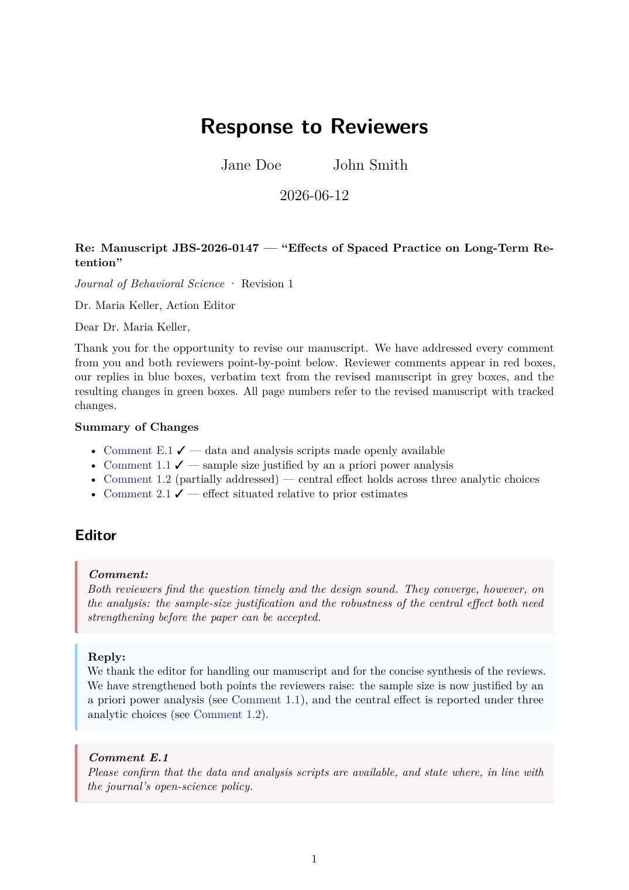
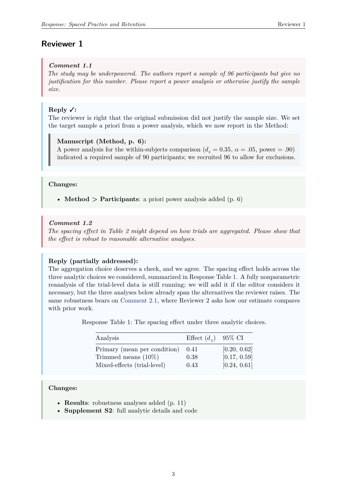

# response-letter

A Quarto extension for writing **responses to reviewers** ("revise and
resubmit" letters) that render to **PDF, DOCX, and HTML** from a single
source file.

Reviewer comments, author replies, manuscript changes, and verbatim quotes
from the revised manuscript each get a visually distinct, auto-numbered box
in every output format — colored `tcolorbox` panels in PDF, shaded
paragraph styles in Word, CSS boxes in HTML. Letter metadata (journal,
manuscript ID, editor, revision round) becomes a letterhead; reply statuses
and a generated summary of changes keep multi-round revisions organized.

## What it looks like

| Letterhead & summary of changes | Numbered response boxes |
| --- | --- |
| [](examples/example.pdf) | [](examples/example.pdf) |

Both pages come from [`template.qmd`](template.qmd) — the same source
renders to [PDF](examples/example.pdf), [DOCX](examples/example.docx), and
[HTML](examples/example.html) (click an image for the full PDF).

## Installation

```bash
quarto add GidonFrischkorn/quarto-response-letter
```

Or start a new letter from the template:

```bash
quarto use template GidonFrischkorn/quarto-response-letter
```

## Usage

```markdown
---
title: "Response to Reviewers"
shorttitle: "Response: Spaced Practice and Retention"   # running header (falls back to title)
author: [Jane Doe, John Smith]
date: last-modified
response-letter:
  journal: "Journal of Behavioral Science"
  manuscript:
    id: "JBS-2026-0147"
    title: "Effects of Spaced Practice on Long-Term Retention"
  round: 1
  editor:
    name: "Dr. Maria Keller"
    role: "Action Editor"
  closing: "Sincerely,"
  signature: |
    Jane Doe
    on behalf of all authors
format:
  response-letter-pdf: default
  response-letter-docx: default
  response-letter-html: default
---

Thank you for the opportunity to revise our manuscript. ...

::: {.response-summary}
:::

# Editor {.editor}

::: {.comment .general}
A general editor remark — unnumbered.
:::

# Reviewer 1

::: {.comment summary="sample size justified by an a priori power analysis"}
The reviewer's comment, quoted verbatim.
:::

::: {.reply status="done"}
Your reply. Markdown works natively here: tables, citations, `code`,
and math like $d_z = 0.35$.

::: {.quoted loc="Method, p. 6"}
A verbatim passage from the revised manuscript, shown in a grey quote
box labeled "Manuscript (Method, p. 6):".
:::
:::

::: {.changes}
- **Method**: what changed, where
:::
```

Note: when a div is nested inside another div (e.g., `.quoted` inside
`.reply`), use four colons (`::::`) for the outer fence.

### Letter metadata

Everything under the `response-letter` key is optional; omitted keys render
nothing, and a document without the key is simply a point-by-point letter
without a letterhead.

| Key | Renders as |
| --- | --- |
| `manuscript.id`, `manuscript.title` | bold "Re: Manuscript JBS-2026-0147 — \"Title\"" line |
| `journal`, `round` | "*Journal of Behavioral Science* · Revision 1" |
| `editor.name`, `editor.role` | address line; a "Dear {name}," salutation is derived when `salutation` is not set |
| `salutation` | explicit salutation (overrides the derived one) |
| `closing`, `signature` | closing block after the last comment; `signature` keeps its line breaks |
| `manuscript.version` | reserved for stating what page/line numbers refer to (use it in your opening paragraph) |
| `colors` | box palette override, e.g. `colors: {reply: "#7A28CB"}` (PDF + HTML) |
| `summary: true / false` | `true` inserts the Summary of Changes before the first section; `false` suppresses it (overrides any `.response-summary` div) |
| `running-header: false` | disables the PDF running header |

### Sections and numbering

Every plain level-1 heading (`# Reviewer 1`) starts the next reviewer:
comments inside are labeled **Comment R.C** and anchored as `#cmt-R-C`.
Two header classes change that:

- `# Editor {.editor}` — editor section; comments are numbered **E.1, E.2,
  …** with anchors `#cmt-E-1`. Convention: place it before the reviewers.
- `# Background {.unnumbered}` — leaves the counters alone.

Link to any comment from anywhere: `[Comment 1.2](#cmt-1-2)`. Use
`` between reviewers for a page break in PDF and DOCX.
`::: {.comment .general}` renders an unnumbered comment for overall
remarks.

### Reply status

```markdown
::: {.reply status="done"}      → label "Reply ✓:"
::: {.reply status="partial"}   → "Reply (partially addressed):"
::: {.reply status="declined"}  → "Reply (respectfully declined):"
::: {.reply status="todo"}      → "Reply (TO DO):" + a render warning
:::
```

While drafting, mark unfinished replies `todo`: rendering prints a warning
listing every unaddressed comment, so nothing slips through before
submission.

### Summary of changes

Give comments a one-line `summary="..."` attribute; they are collected into
a linked list with their status, e.g. "Comment 1.1 ✓ — sample size
justified by an a priori power analysis". Two ways to include it:

- **YAML flag**: `response-letter: summary: true` inserts the summary
  automatically before the first section heading (after your opening
  prose); `summary: false` suppresses it document-wide.
- **Explicit placement**: put the placeholder div exactly where the summary
  belongs (it wins over the automatic position):

```markdown
::: {.response-summary}
:::
```

### Running headline

From page 2 of the PDF, a running header shows `shorttitle` (or `title`)
on the left and the current section — "Reviewer 1", "Editor" — on the
right. In DOCX the header uses Word fields (document title + current
`# Reviewer N` heading; field values appear once Word repaginates, e.g. on
open or print preview). HTML has no pages; the table of contents covers
navigation.

### Figures, tables, citations

Response-only exhibits are numbered separately from your manuscript's
figures, so "Figure 3" in a reply unambiguously means the manuscript:
labeled figures/tables are captioned **Response Figure 1** / **Response
Table 1** and referenced with the usual `@fig-...` / `@tbl-...` syntax.
They render inline inside reply boxes (nothing floats — `fig-pos: H` is
the PDF default). Override the names via the standard `crossref` options.

Citations work as in any Quarto document. Point `bibliography:` at the same
`.bib` file as your manuscript so quoted revised text resolves without
re-keying; the reference list is placed after the closing/signature, like
an attachment. Set `csl:` to your journal's style if you care about the
reference format.

### Custom labels (e.g., for non-English letters)

Every user-visible string localizes through the `language` key:

```yaml
language:
  response-reviewer-label: "Gutachter"
  response-editor-label: "Herausgeber"
  response-comment-label: "Kommentar"
  response-reply-label: "Antwort"
  response-changes-label: "Änderungen"
  response-quoted-label: "Manuskript"     # also used in the "Re:" line
  response-summary-title: "Zusammenfassung der Änderungen"
  response-re-label: "Betreff:"
  response-dear-label: "Sehr geehrte Frau"
  response-round-label: "Revision"
  response-status-partial: "teilweise umgesetzt"
```

## Format notes

| Format | Styling | Notes |
| --- | --- | --- |
| PDF | breakable `tcolorbox` panels | long boxes split cleanly across pages; running header via fancyhdr |
| DOCX | shaded paragraph styles from `reference.docx` | ideal for co-author comments and tracked changes |
| HTML | CSS boxes, left-hand table of contents | self-contained file (`embed-resources: true`) |

**Lists in DOCX boxes:** pandoc cannot carry paragraph styles into real
Word list items, so lists inside boxes are converted to one shaded
paragraph per item with a literal bullet/number (styles
`Response ... List` in `reference.docx`, hanging indent included). The
shading stays continuous; the items are plain paragraphs rather than Word
list objects.

**Symbols in PDF:** prefer math mode (`$\approx$`, `$\times$`) over the
literal Unicode characters `≈`/`×`, which some LaTeX fonts silently drop.
(The status checkmark is handled for you.)

## Customizing

- **Box colors**: set `response-letter: colors:` in the document YAML —
  one palette drives PDF and HTML.
- **PDF box geometry/spacing**: edit `_extensions/response-letter/header.tex`
  (standard `tcolorbox` options; colors are injected, edit the YAML instead).
- **Word styles**: edit the styles `Response Comment`, `Response Reply`,
  `Response Changes`, `Response Quote`, and `Response Label` in
  `_extensions/response-letter/reference.docx`, or rebuild it (palette and
  running header included) with `tools/make_reference_docx.py`.
- **HTML**: override the CSS custom properties (`--rl-comment`, …) or the
  classes in `response-letter.css`.

## Development

CI renders `template.qmd` to all three formats against Quarto release and
pre-release (weekly), catching breakage from new Quarto versions. See
`CHANGELOG.md` for versions. `tools/make_reference_docx.py` regenerates
`reference.docx` (palette, box styles, running header) from the defaults
in `_extension.yml`. After changing the template or styles, refresh
`examples/` from the rendered outputs and regenerate the README
screenshots, e.g. `pdftoppm -r 130 -png -f 1 -l 1 examples/example.pdf`.

## License

MIT. Contributions and issues welcome.
